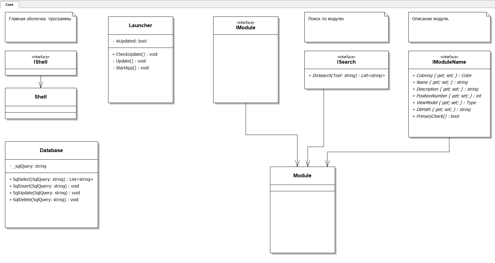

:revealjs_theme: white
:revealjs_controls: false
:revealjs_slideNumber: true
:revealjs_center: false
:revealjs_transition: fade

== &nbsp; 
[.lead]
ФГБОУ ВПО РОССИЙСКИЙ ЭКОНОМИЧЕСКИЙ УНИВЕРСИТЕТ ИМЕНИ Г.В. ПЛЕХАНОВА

МОСКОВСКИЙ ПРИБОРОСТРОИТЕЛЬНЫЙ ТЕХНИКУМ

Преддипломная практика

П-2-11

Мосеин Павел 

Байков Семен

2015

== Задание

Разработка Интерактивной системы 

Помощник машиниста

Предметная область

== Помощник машиниста

Разделение ответственности

Ядро. Архитектура. 

Модули. Дизайн.

== Технологии

Windows

C#, WPF

Patterns

SQLite

== Библиотеки

Caliburn.Micro

MahApps.Metro

Nlog

XUnit

CefSharp

== Проектирование

[[schema]]

