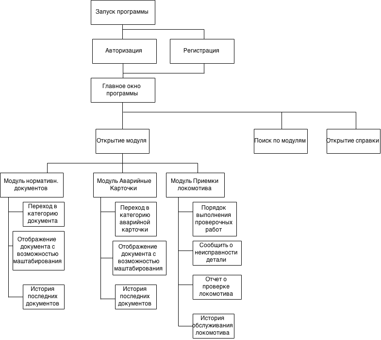

:revealjs_theme: white
:revealjs_controls: false
:revealjs_slideNumber: true
:revealjs_center: false
:revealjs_transition: fade

== &nbsp; 
[.lead]
ФГБОУ ВПО РОССИЙСКИЙ ЭКОНОМИЧЕСКИЙ УНИВЕРСИТЕТ ИМЕНИ Г.В. ПЛЕХАНОВА

МОСКОВСКИЙ ПРИБОРОСТРОИТЕЛЬНЫЙ ТЕХНИКУМ

ПМ.03 Участие в интеграции программных модулей.

П-2-11

Мосеин Павел 

Байков Семен

2015

== Професcиональные компетенции

ПК 3.1 Анализировать проектную и техническую документацию на уровне взаимодействия компонент програмного обеспечения.

ПК 3.2 Выполнять интеграцию модулей в программную систему.

ПК 3.3 Выполнять отладку программного продукта с использованием специализированных программных средств.

== Професcиональные компетенции

ПК 3.4 Осуществлять разработку тестовых наборов и тестовых сценариев.

ПК 3.5 Производить инспектирование компонент программного продукта на предмет соответствия стандартам кодирования.

ПК 3.6 Разрабатывать технологическую документацию.

== Структура ПМ.03

МДК 03.01 ТРПО

ИСРПО 

Документация и сертификация 

ПП.03.01 ТРПО

== ПП.03.01

ИС Помощник машиниста

23.02.2015 - 15.04.2015

== Начало работы

Предметная область

ГОСТ 19 класса - ТЗ 

Схема пользовательского интерфейса

== Проектирование

Ядро - Модули

[[schema]]

== Case-средства

Visual Studio 2013 Community

ReSharper, dotMemmory, dotTrace

SQLite Manager

== Использованные библиотеки

MahApps.Metro

Caliburn.Micro 2

xUnit

NLog

CefSharp

== Отладчик

Встроенный в Visual Studio 2013.

Основные возможности:

Точки останова

Слежения

== Логирование

Nlog

Запись в файл

Отправка на почту

Разделение уровней ответственности

== Тестирование

xUnit  

Интеграция в IDE

== Качество кодирования

C# Coding Conventions

== Выводы

Все компетенции были выполнены.